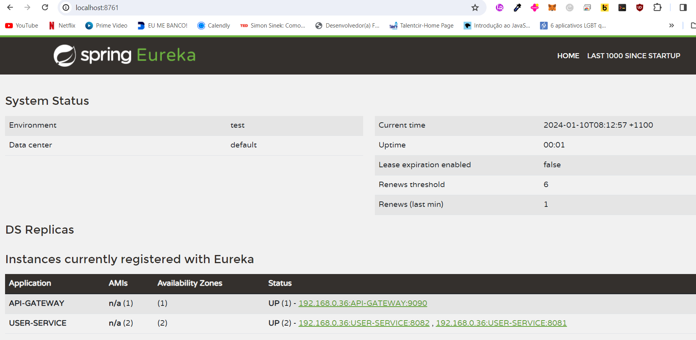
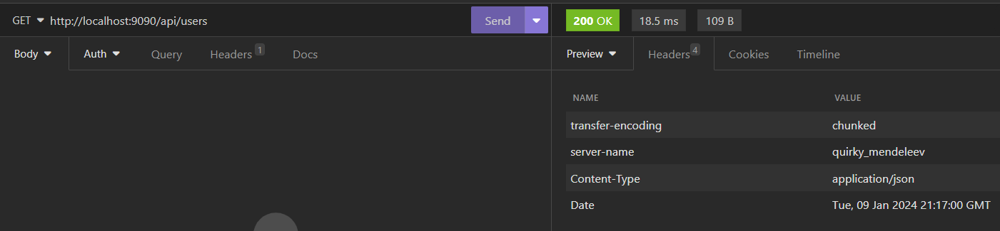
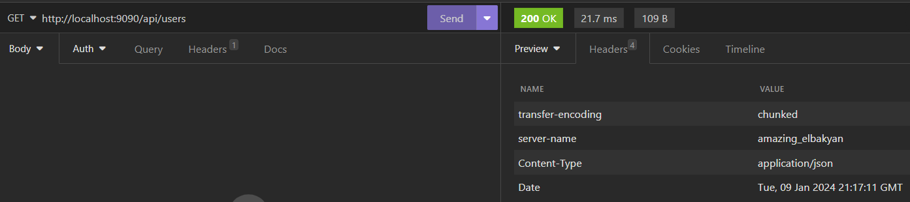
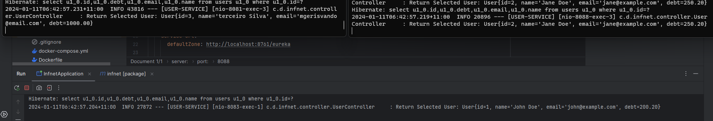
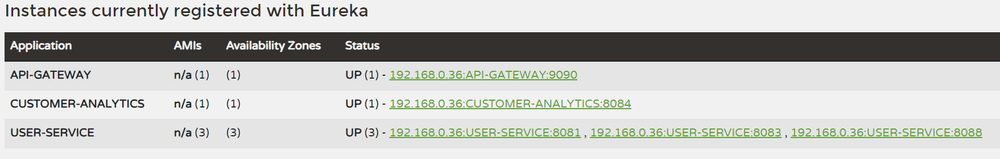

# Java + Spring Boot

# You also need to clone the repository:  <a href="https://github.com/emersonope/db" target="_blank" rel="noopener noreferrer">User API</a>.</p> in order to run the project.

# Checklist

## Requirements to run the project:
- Java 17 installed 
- Git installed
- download all the necessary repositories to run the project correctly
- Access by clicking here:  <a href="https://github.com/emersonope/db" target="_blank" rel="noopener noreferrer">User API</a>.</p>
- IntelliJ IDE (Or other as you prefer)
- Docker or PostgreSQL install to run the databases

## To run the project

- First you need to run the Eureka-Service to avoid problems
- Run the gateway API
- Then you can run the USER-SERVICE and CUSTOMER-ANALYTICS api
- The User-Service API run the databases on docker, if you wish you can run locally on you machine <a href= "https://hub.docker.com/_/postgres" target="_blank" rel="noopener noreferrer">Docker Documentation API</a>.</p>

```
Just download the maven dependences and press "RUN" the main class to run the application on your IDE
```

## Eureka-service



## API-Gateway (Router - GET: http://localhost:9090/api/users)
#### As soon as you have an application as an Eureka-Client, the Gateway will automatically make the load balancer:

- First request at Tue, 09 Jan 2024 21:17:00 GMT:


- First request at 	Tue, 09 Jan 2024 21:17:11 GMT:


#### When you run all the API in this project, you can verify if the Load Balancer is dividing the request by running multiple instances of an API, follow an example: 



- FYI: This image show three instances of the API USER-SERVICE running and the CUSTOMER-ANALYTICS send a request:



## Documentation:

### Swagger

``http://localhost:8084/swagger-ui/index.html``